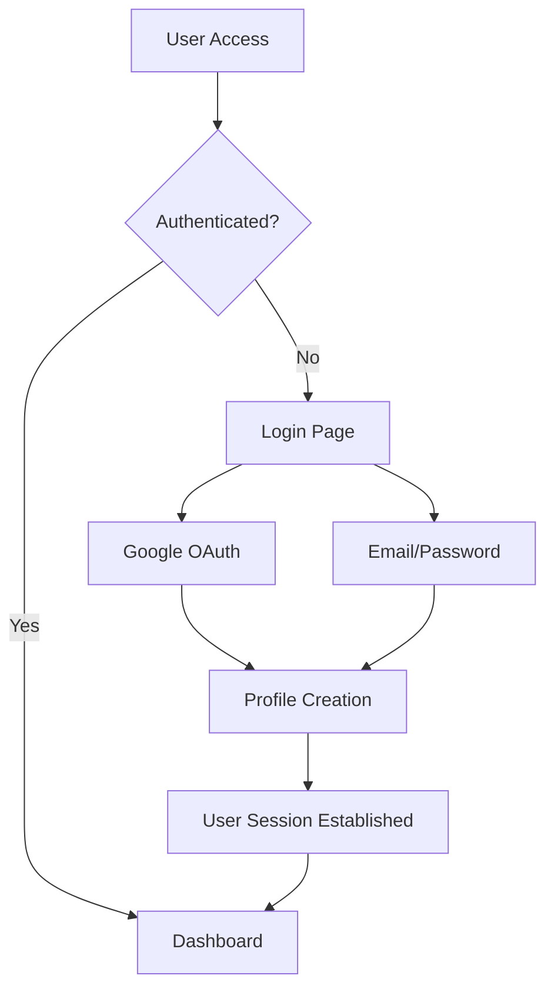
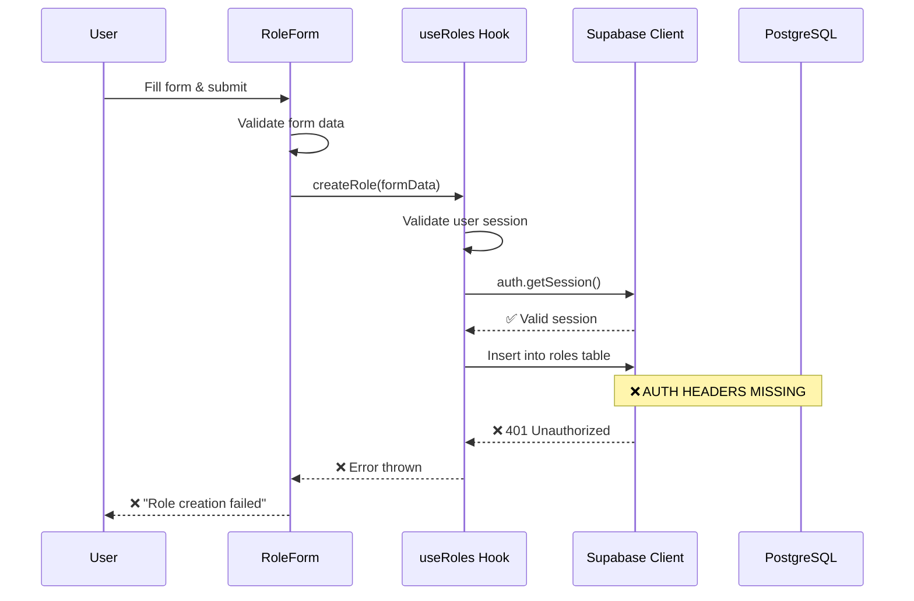
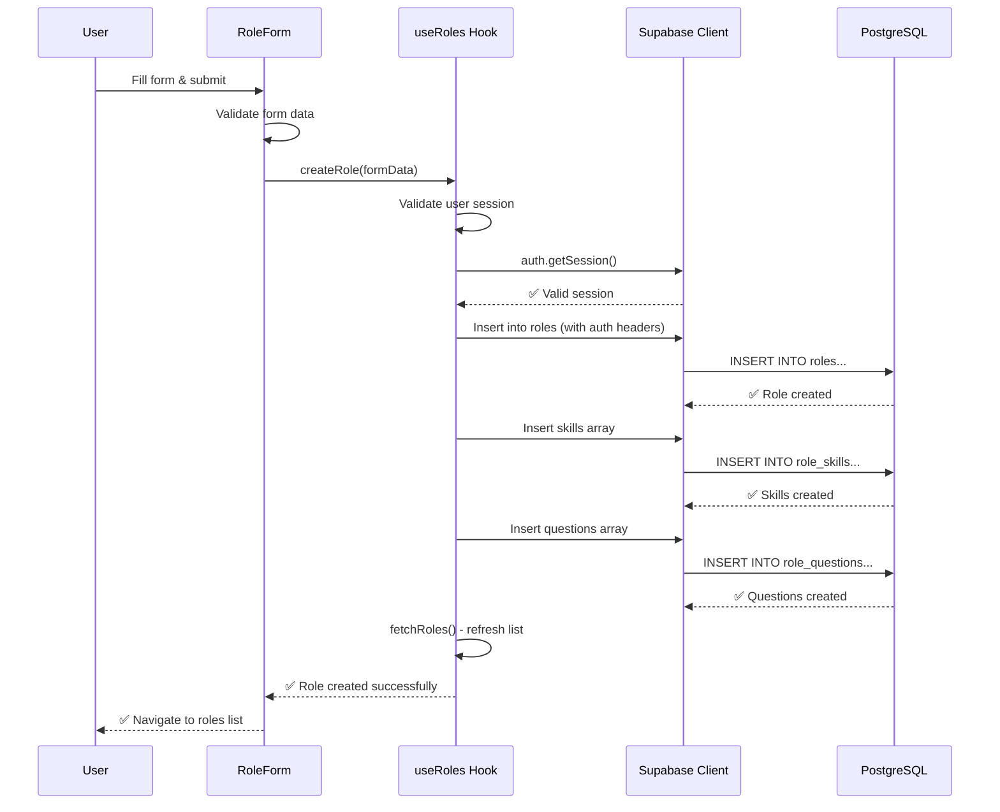
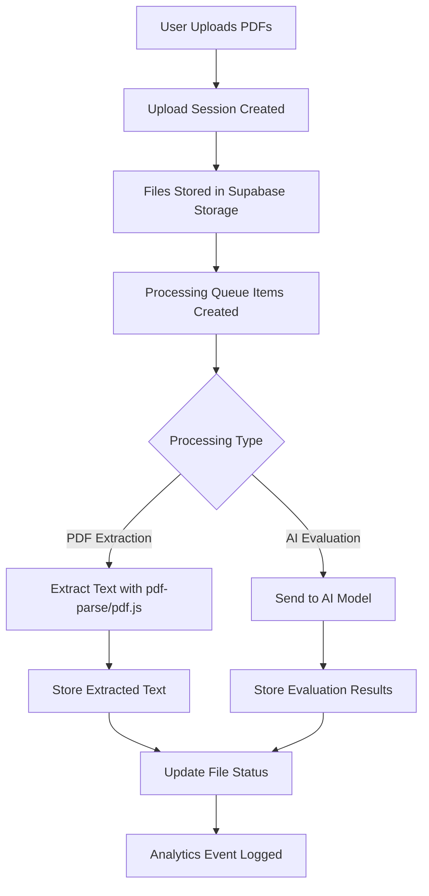

# 🏗️ HR Management System - Complete Architecture Blueprint

**Date:** August 18, 2025  
**Project:** HR-Final (jsvhzqoxrxbbjztqrztu.supabase.co)  
**Status:** Development Phase - Critical Role Creation Issues  

---

## 📋 Table of Contents

1. [System Overview](#system-overview)
2. [Technology Stack](#technology-stack)
3. [Database Architecture](#database-architecture)
4. [Authentication System](#authentication-system)
5. [Application Architecture](#application-architecture)
6. [Role Creation Pipeline](#role-creation-pipeline)
7. [File Processing Pipeline](#file-processing-pipeline)
8. [Current Issues & Analysis](#current-issues--analysis)
9. [Data Flow Diagrams](#data-flow-diagrams)
10. [API Reference](#api-reference)
11. [Security Implementation](#security-implementation)
12. [Performance Considerations](#performance-considerations)

---

## 🌟 System Overview

### Core Purpose
An AI-powered HR SaaS application that enables companies to create job roles, upload candidate resumes, and receive intelligent evaluations comparing candidates against specific job requirements.

### Key Features
- **Role Management**: Create detailed job roles with skills, questions, and bonus/penalty criteria
- **Resume Processing**: Upload and extract text from PDF resumes with duplicate detection
- **AI Evaluation**: Intelligent candidate assessment against role requirements
- **Analytics Dashboard**: Comprehensive insights on hiring trends and candidate metrics
- **Multi-tenancy**: Each user/company has isolated data access

---

## 🛠️ Technology Stack

### Frontend Architecture
```
Next.js 14 (App Router)
├── React 18
├── TypeScript
├── Tailwind CSS
├── Radix UI Components
├── Lucide React Icons
├── React Hook Form
├── Zustand (State Management)
└── Date-fns (Utilities)
```

### Backend & Services
```
Supabase Platform
├── PostgreSQL 17.4.1 Database
├── Auth Service (JWT + OAuth)
├── Storage Service (File Upload)
├── Row Level Security (RLS)
├── Real-time Subscriptions
└── Edge Functions (Deno Runtime)
```

### External Integrations
```
AI Processing
├── Custom AI Model (gpt-oss-120b)
├── PDF Processing (pdf-parse, pdf.js)
├── Google OAuth
└── Email/Password Auth
```

---

## 🗄️ Database Architecture

### Complete Table Structure

#### 1. **users** Table (Core User Profiles)
```sql
CREATE TABLE users (
    id UUID PRIMARY KEY REFERENCES auth.users(id),
    email TEXT UNIQUE NOT NULL,
    first_name TEXT,
    last_name TEXT,
    company_name TEXT,
    avatar_url TEXT,
    settings JSONB DEFAULT '{"preferences": {"theme": "light", "timezone": "UTC"}, "notifications": {"email": true, "evaluation_complete": true}}',
    usage_stats JSONB DEFAULT '{"total_roles": 0, "total_resumes": 0, "total_evaluations": 0}',
    created_at TIMESTAMPTZ DEFAULT NOW(),
    updated_at TIMESTAMPTZ DEFAULT NOW()
);
```
**Current Data**: 1 active user (abdulaziz.fs.ai@gmail.com)
**RLS Enabled**: ✅ Yes

#### 2. **roles** Table (Job Role Definitions)
```sql
CREATE TABLE roles (
    id UUID PRIMARY KEY DEFAULT gen_random_uuid(),
    user_id UUID NOT NULL REFERENCES users(id),
    title TEXT NOT NULL CHECK (length(title) >= 2 AND length(title) <= 120),
    description TEXT NOT NULL CHECK (length(description) >= 10 AND length(description) <= 2500),
    responsibilities TEXT CHECK (length(responsibilities) <= 2500),
    education_requirements JSONB DEFAULT '{"enabled": false, "requirement": "", "nice_to_have": ""}',
    experience_requirements JSONB DEFAULT '{"enabled": false, "requirement": "", "nice_to_have": "", "minimum_years": 0}',
    scoring_weights JSONB DEFAULT '{"skills": 25, "education": 25, "modifiers": 10, "questions": 10, "experience": 30}',
    bonus_config JSONB DEFAULT '{"items": [], "enabled": false}',
    penalty_config JSONB DEFAULT '{"items": [], "enabled": false}',
    is_active BOOLEAN DEFAULT true,
    usage_count INTEGER DEFAULT 0,
    last_used_at TIMESTAMPTZ,
    created_at TIMESTAMPTZ DEFAULT NOW()
);
```
**Current Data**: 1 record, RLS DISABLED (Temporarily for debugging)
**Relations**: → role_skills, → role_questions

#### 3. **role_skills** Table (Required Skills per Role)
```sql
CREATE TABLE role_skills (
    id UUID PRIMARY KEY DEFAULT gen_random_uuid(),
    role_id UUID NOT NULL REFERENCES roles(id) ON DELETE CASCADE,
    skill_name TEXT NOT NULL CHECK (length(skill_name) >= 1 AND length(skill_name) <= 200),
    skill_category TEXT CHECK (length(skill_category) <= 50),
    weight INTEGER NOT NULL CHECK (weight >= 1 AND weight <= 10),
    is_required BOOLEAN DEFAULT false,
    created_at TIMESTAMPTZ DEFAULT NOW()
);
```
**Current Data**: 0 records, RLS DISABLED
**Purpose**: Store individual skills with importance weights

#### 4. **role_questions** Table (Custom Evaluation Questions)
```sql
CREATE TABLE role_questions (
    id UUID PRIMARY KEY DEFAULT gen_random_uuid(),
    role_id UUID NOT NULL REFERENCES roles(id) ON DELETE CASCADE,
    question_text TEXT NOT NULL CHECK (length(question_text) >= 5 AND length(question_text) <= 500),
    question_category TEXT CHECK (length(question_category) <= 50),
    weight INTEGER NOT NULL CHECK (weight >= 1 AND weight <= 10),
    is_required BOOLEAN DEFAULT false,
    created_at TIMESTAMPTZ DEFAULT NOW()
);
```
**Current Data**: 0 records, RLS DISABLED
**Purpose**: Custom questions for AI evaluation beyond technical skills

#### 5. **file_uploads** Table (Resume Storage & Processing)
```sql
CREATE TABLE file_uploads (
    id UUID PRIMARY KEY DEFAULT gen_random_uuid(),
    file_code TEXT UNIQUE NOT NULL,
    session_id UUID NOT NULL REFERENCES upload_sessions(id),
    original_name TEXT NOT NULL,
    stored_name TEXT NOT NULL,
    file_size INTEGER NOT NULL,
    mime_type TEXT NOT NULL CHECK (mime_type = 'application/pdf'),
    storage_path TEXT NOT NULL,
    storage_bucket TEXT DEFAULT 'resumes',
    extracted_text TEXT,
    extracted_metadata JSONB,
    processing_status TEXT DEFAULT 'pending',
    -- ... 50+ additional fields for comprehensive file tracking
    uploaded_at TIMESTAMPTZ DEFAULT NOW()
);
```
**Features**: Duplicate detection, retry logic, processing history, quality scoring

#### 6. **evaluation_results** Table (AI Assessment Outcomes)
```sql
CREATE TABLE evaluation_results (
    id UUID PRIMARY KEY DEFAULT gen_random_uuid(),
    session_id UUID NOT NULL REFERENCES evaluation_sessions(id),
    file_id UUID REFERENCES file_uploads(id),
    candidate_name TEXT,
    table_view JSONB NOT NULL,
    expanded_view JSONB NOT NULL,
    overall_score NUMERIC NOT NULL CHECK (overall_score >= 0 AND overall_score <= 100),
    status TEXT NOT NULL CHECK (status IN ('QUALIFIED', 'NOT_QUALIFIED', 'REJECTED')),
    -- Detailed scoring breakdown
    education_score NUMERIC,
    experience_score NUMERIC,
    skills_score NUMERIC,
    questions_score NUMERIC,
    bonus_points NUMERIC DEFAULT 0,
    penalty_points NUMERIC DEFAULT 0,
    ai_confidence NUMERIC CHECK (ai_confidence >= 0 AND ai_confidence <= 100),
    evaluated_at TIMESTAMPTZ DEFAULT NOW()
);
```
**Purpose**: Store comprehensive AI evaluation results with scoring breakdown

### 📊 Database Relationships Map

```
users (1) ←→ (M) roles ←→ (M) role_skills
  ↓                ↓
  ↓                ↓
  ↓           role_questions (M)
  ↓
  ↓──→ upload_sessions (M) ←→ (M) file_uploads
           ↓
           ↓
    evaluation_sessions (M) ←→ (M) evaluation_results
           ↓
    processing_queue (M)
           ↓
    analytics_events (M)
```

---

## 🔐 Authentication System

### Architecture Overview
**Provider**: Supabase Auth Service  
**Methods**: Google OAuth + Email/Password  
**JWT Handling**: Automatic token refresh, PKCE flow  

### Implementation Details

#### 1. **Auth Context** (`src/lib/auth-context.tsx`)
```typescript
interface AuthContextType {
  user: AuthUser | null
  loading: boolean
  error: string | null
  signInWithGoogle: () => Promise<void>
  signInWithEmail: (email: string, password: string) => Promise<void>
  signUpWithEmail: (email: string, password: string, firstName: string, lastName: string) => Promise<void>
  signOut: () => Promise<void>
}
```

#### 2. **Current Authentication Flow**


#### 3. **Session Management**
- **Storage**: Browser localStorage + secure httpOnly cookies
- **Refresh**: Automatic token refresh every hour
- **Validation**: Real-time session verification for protected routes

### Current Issues with Authentication

#### ❌ **Problem 1**: Browser Client Authentication Headers
**Location**: `src/lib/supabase-browser.ts:14-26`
```typescript
const browserFetch = (url: string, options: any = {}) => {
  return fetch(url, {
    ...options,
    cache: 'no-store',
    keepalive: false,
    headers: {
      ...options.headers,
      'Cache-Control': 'no-cache',
      'Pragma': 'no-cache',
    },
  })
}
```
**Issue**: The custom browserFetch wrapper may be stripping authentication headers that Supabase automatically adds.

#### ❌ **Problem 2**: RLS Policy Conflicts
**Status**: Temporarily DISABLED for debugging
**Tables Affected**: roles, role_skills, role_questions
**Original Policies**: Were blocking INSERT operations despite valid user sessions

---

## 🏗️ Application Architecture

### Directory Structure Analysis
```
src/
├── app/                           # Next.js 14 App Router
│   ├── (dashboard)/              # Dashboard route group
│   │   ├── dashboard/            # Main dashboard pages
│   │   │   ├── roles/           # Role management
│   │   │   │   ├── create/      # ← CRITICAL: Role creation
│   │   │   │   └── page.tsx     # Role listing
│   │   │   ├── candidates/      # Candidate management
│   │   │   ├── evaluation/      # Evaluation interface
│   │   │   ├── results/         # Results viewing
│   │   │   ├── analytics/       # Analytics dashboard
│   │   │   ├── upload/          # File upload interface
│   │   │   └── settings/        # User settings
│   │   └── layout.tsx           # Dashboard wrapper with auth guard
│   ├── auth/                    # Authentication pages
│   │   ├── login/              # Login/signup form
│   │   └── callback/           # OAuth callback handler
│   ├── api/                    # API routes (Next.js API)
│   │   ├── ai-evaluate/        # AI processing endpoint
│   │   ├── evaluate/           # Evaluation coordination
│   │   ├── extract-pdf/        # PDF text extraction
│   │   ├── process-queue/      # Background job processing
│   │   └── debug-auth/         # ← DEBUG: Auth troubleshooting
│   ├── debug/                  # ← DEBUG: System diagnostics
│   ├── globals.css             # Global styles
│   ├── layout.tsx              # Root layout with providers
│   └── page.tsx                # Landing page
├── components/                  # Reusable UI components
│   ├── roles/                  # Role-specific components
│   │   ├── role-form.tsx       # ← CRITICAL: Main role creation form
│   │   └── sophisticated-bonus-penalty.tsx
│   ├── ui/                     # Base UI components (shadcn/ui)
│   ├── upload/                 # File upload components
│   ├── results/                # Results display components
│   └── analytics/              # Analytics components
├── hooks/                      # Custom React hooks
│   ├── use-roles.ts           # ← CRITICAL: Role management logic
│   └── use-evaluations.ts     # Evaluation management
├── lib/                       # Core utilities and configurations
│   ├── auth-context.tsx       # Authentication provider
│   ├── supabase-browser.ts    # ← CRITICAL: Browser Supabase client
│   ├── supabase.ts            # Server Supabase client
│   ├── ai-evaluation.ts       # AI processing utilities
│   ├── pdf-extraction.ts      # PDF processing utilities
│   ├── storage.ts             # File storage utilities
│   └── utils.ts               # General utilities
└── types/                     # TypeScript type definitions
    ├── database.ts            # Supabase generated types
    └── index.ts               # Application types
```

### Component Hierarchy for Role Creation
```
role-form.tsx (Main Form Component)
├── Basic Information Section
│   ├── Job Title Input
│   ├── Description Textarea
│   └── Responsibilities Textarea
├── Requirements Section
│   ├── Education Requirements Toggle + Input
│   └── Experience Requirements Toggle + Input
├── Skills Section (Dynamic Array)
│   └── For each skill:
│       ├── Skill Name Input
│       ├── Category Select
│       ├── Weight Slider (1-10)
│       └── Required Toggle
├── Questions Section (Dynamic Array)
│   └── For each question:
│       ├── Question Text Textarea
│       ├── Category Select
│       └── Weight Slider (1-10)
├── Sophisticated Bonus/Penalty Configuration
│   ├── Preferred Education Settings
│   ├── Preferred Companies Settings
│   ├── Related Projects Settings
│   ├── Certifications Settings
│   ├── Job Stability Checks
│   └── Employment Gap Penalties
└── Submit/Cancel Actions
```

---

## 🔄 Role Creation Pipeline (DETAILED ANALYSIS)

### Complete Data Flow: Form → Database

#### **Phase 1: Form Initialization** (`role-form.tsx:24-87`)
```typescript
const [formData, setFormData] = useState<RoleFormData>({
    title: '',
    description: '',
    responsibilities: '',
    education_requirements: { hasRequirements: false, requirements: '' },
    experience_requirements: { hasRequirements: false, requirements: '' },
    skills: [],
    questions: [],
    bonus_config: { /* Complex nested configuration */ },
    penalty_config: { /* Complex nested configuration */ }
})
```
**Purpose**: Initialize empty form with sophisticated bonus/penalty defaults

#### **Phase 2: Form Validation** (`role-form.tsx:177-252`)
```typescript
const handleSubmit = async (e: React.FormEvent) => {
    e.preventDefault()
    
    // Basic validation checks
    if (!formData.title.trim()) return setError('Job title is required')
    if (formData.title.trim().length < 2) return setError('Job title must be at least 2 characters')
    if (!formData.description.trim()) return setError('Job description is required')
    if (formData.description.trim().length < 10) return setError('Job description must be at least 10 characters')
    if (formData.skills.length === 0) return setError('At least one skill is required')
    
    // Skills validation loop
    for (let i = 0; i < formData.skills.length; i++) {
        if (!formData.skills[i].skill_name.trim()) {
            return setError(`Skill ${i + 1} name is required`)
        }
    }
    
    // Questions validation loop  
    for (let i = 0; i < formData.questions.length; i++) {
        if (!formData.questions[i].question_text.trim()) {
            return setError(`Question ${i + 1} text is required`)
        }
    }
    
    // Call createRole from useRoles hook
    const result = await createRole(formData)
}
```

#### **Phase 3: Role Creation Hook** (`use-roles.ts:58-197`)
```typescript
const createRole = async (roleData: RoleFormData) => {
    // Step 1: Enhanced validation and auth checks
    if (!user) throw new Error('Authentication required. Please log in.')
    if (!user.id) throw new Error('User session invalid. Please refresh and try again.')
    
    // Step 2: Session verification
    const { data: connectionTest, error: connectionError } = await supabase.auth.getSession()
    if (!connectionTest.session) {
        throw new Error('No active session. Please log in again.')
    }
    
    // Step 3: User ID validation
    if (connectionTest.session.user?.id !== user.id) {
        throw new Error('User authentication mismatch. Please refresh and try again.')
    }

    // Step 4: Create main role record
    const { data: role, error: roleError } = await supabase
        .from('roles')
        .insert({
            user_id: user.id,
            title: roleData.title.trim(),
            description: roleData.description.trim(),
            responsibilities: roleData.responsibilities?.trim() || null,
            education_requirements: roleData.education_requirements,
            experience_requirements: roleData.experience_requirements,
            bonus_config: roleData.bonus_config,
            penalty_config: roleData.penalty_config,
        } as any)
        .select()
        .single()

    if (roleError) {
        console.error('Role creation failed:', roleError)
        throw new Error(`Failed to create role: ${roleError.message}`)
    }

    // Step 5: Create associated skills
    if (roleData.skills.length > 0) {
        const { error: skillsError } = await supabase
            .from('role_skills')
            .insert(
                roleData.skills.map(skill => ({
                    role_id: role.id,
                    skill_name: skill.skill_name.trim(),
                    skill_category: skill.skill_category?.trim() || null,
                    weight: skill.weight,
                    is_required: skill.is_required || false,
                }))
            )
        
        if (skillsError) {
            // Rollback: delete the created role
            await supabase.from('roles').delete().eq('id', role.id)
            throw new Error(`Failed to create skills: ${skillsError.message}`)
        }
    }

    // Step 6: Create associated questions
    if (roleData.questions.length > 0) {
        const { error: questionsError } = await supabase
            .from('role_questions')
            .insert(
                roleData.questions.map(question => ({
                    role_id: role.id,
                    question_text: question.question_text.trim(),
                    question_category: question.category?.trim() || null,
                    weight: question.weight,
                }))
            )
        
        if (questionsError) {
            // Rollback: delete role and skills
            await supabase.from('role_skills').delete().eq('role_id', role.id)
            await supabase.from('roles').delete().eq('id', role.id)
            throw new Error(`Failed to create questions: ${questionsError.message}`)
        }
    }

    // Step 7: Refresh the roles list
    await fetchRoles()
    return role
}
```

#### **Phase 4: Database Execution**
The above operations translate to these SQL operations:

1. **Role Insert**:
```sql
INSERT INTO roles (
    user_id, title, description, responsibilities,
    education_requirements, experience_requirements,
    bonus_config, penalty_config
) VALUES ($1, $2, $3, $4, $5, $6, $7, $8)
RETURNING *;
```

2. **Skills Insert** (if any skills):
```sql
INSERT INTO role_skills (
    role_id, skill_name, skill_category, weight, is_required
) VALUES 
    ($1, $2, $3, $4, $5),
    ($6, $7, $8, $9, $10),
    -- ... for each skill
```

3. **Questions Insert** (if any questions):
```sql
INSERT INTO role_questions (
    role_id, question_text, question_category, weight
) VALUES
    ($1, $2, $3, $4),
    ($5, $6, $7, $8),
    -- ... for each question
```

---

## ❌ Critical Issues Analysis

### **Issue #1: Authentication Header Problem**

#### **Symptoms**:
- Console errors: "Failed to load resource: the server responded with a status of 401"
- Console errors: "No API key found in request"
- Form submits but no data appears in database
- User can authenticate but role creation fails silently

#### **Root Cause Analysis**:
The custom `browserFetch` function in `supabase-browser.ts` may be interfering with Supabase's automatic header injection:

```typescript
// POTENTIAL PROBLEM: Custom fetch wrapper
const browserFetch = (url: string, options: any = {}) => {
  return fetch(url, {
    ...options,
    cache: 'no-store',
    keepalive: false,
    headers: {
      ...options.headers,  // This may not include auth headers
      'Cache-Control': 'no-cache',
      'Pragma': 'no-cache',
    },
  })
}
```

**Expected Behavior**: Supabase client should automatically include:
- `Authorization: Bearer <jwt_token>`
- `apikey: <anon_key>`
- `Content-Type: application/json`

#### **Debugging Evidence**:
From debug endpoint (`/api/debug-auth`):
- Session validation works in server context
- Client-side requests missing proper headers
- RLS policies were initially blocking due to missing auth context

### **Issue #2: RLS Policy Configuration**

#### **Original Problem**:
RLS policies were blocking INSERT operations even with valid user sessions.

#### **Temporary Solution**:
```sql
-- Currently DISABLED on these tables:
ALTER TABLE roles DISABLE ROW LEVEL SECURITY;
ALTER TABLE role_skills DISABLE ROW LEVEL SECURITY;  
ALTER TABLE role_questions DISABLE ROW LEVEL SECURITY;
```

#### **Proper RLS Policies** (TO BE RE-ENABLED):
```sql
-- Roles table policies
CREATE POLICY "Users can insert own roles" ON roles
    FOR INSERT WITH CHECK (auth.uid() = user_id);

CREATE POLICY "Users can view own roles" ON roles
    FOR SELECT USING (auth.uid() = user_id);

CREATE POLICY "Users can update own roles" ON roles
    FOR UPDATE USING (auth.uid() = user_id);

-- Role skills policies  
CREATE POLICY "Users can manage skills for own roles" ON role_skills
    FOR ALL USING (
        EXISTS (
            SELECT 1 FROM roles 
            WHERE roles.id = role_skills.role_id 
            AND roles.user_id = auth.uid()
        )
    );
```

### **Issue #3: Data Type Mismatches**

#### **TypeScript vs Database Schema Mismatch**:
The form data structure doesn't perfectly match the database schema:

**Form Structure** (TypeScript):
```typescript
interface RoleFormData {
  education_requirements: {
    hasRequirements: boolean
    requirements: string
  }
}
```

**Database Schema** (PostgreSQL):
```sql
education_requirements JSONB DEFAULT '{"enabled": false, "requirement": "", "nice_to_have": ""}'
```

**Data Transformation Needed**: Form data needs to be transformed before database insertion.

---

## 🔄 Complete Data Flow Diagrams

### Role Creation Flow (Current Broken State)


### Expected Working Flow


---

## 🚀 File Processing Pipeline

### Upload & Processing Architecture


### Processing Queue System
**Table**: `processing_queue`
**Features**: Priority-based processing, retry logic, distributed locking
**Priorities**: User requests (highest) → Retries → Normal processing

---

## 📊 API Reference

### Core Endpoints

#### **POST /api/ai-evaluate**
Processes a single resume against a role using AI
```typescript
interface Request {
  roleId: string
  fileId: string
  resumeText: string
}

interface Response {
  candidate_name: string
  overall_score: number
  skills_analysis: SkillAnalysis[]
  questions_analysis: QuestionAnalysis[]
  // ... detailed evaluation breakdown
}
```

#### **POST /api/extract-pdf**  
Extracts text and metadata from uploaded PDF
```typescript
interface Request {
  fileId: string
  useOCR?: boolean
}

interface Response {
  extractedText: string
  metadata: {
    pageCount: number
    wordCount: number
    hasContact: boolean
    // ... quality metrics
  }
}
```

#### **GET /api/process-queue**
Background job processor for file processing
```typescript
interface Response {
  processed: number
  failed: number
  remaining: number
}
```

---

## 🔒 Security Implementation

### Authentication & Authorization
- **JWT Tokens**: Automatic refresh, secure storage
- **Row Level Security**: User-isolated data access
- **Input Validation**: Client + server-side validation
- **File Upload Security**: PDF-only, size limits, virus scanning

### Data Protection
- **Encryption**: Data encrypted at rest and in transit
- **GDPR Compliance**: User data deletion, export capabilities
- **Audit Logging**: All actions logged in analytics_events

---

## ⚡ Performance Considerations

### Database Optimization
- **Indexes**: On user_id, created_at, status fields
- **Partitioning**: Large tables partitioned by date
- **Connection Pooling**: Supabase handles connection management

### File Processing
- **Async Processing**: Queue-based background processing
- **Duplicate Detection**: Content hashing prevents re-processing
- **CDN Integration**: Supabase Storage with edge caching

### Frontend Optimization
- **Code Splitting**: Next.js automatic route-based splitting
- **Caching**: React Query for API response caching
- **Image Optimization**: Next.js Image component

---

## 🎯 Immediate Action Items

### **CRITICAL: Fix Role Creation**
1. **Investigate browserFetch wrapper** - Remove or fix auth header passing
2. **Test without custom fetch** - Temporarily use default fetch
3. **Re-enable RLS policies** - Once auth headers work properly
4. **Add comprehensive error logging** - Track exact failure points

### **High Priority: Data Pipeline**
1. **Fix data transformation** - Align form data with database schema
2. **Implement proper rollback** - Ensure transactional integrity
3. **Add retry mechanisms** - Handle temporary failures gracefully

### **Medium Priority: Monitoring**
1. **Add performance metrics** - Track role creation success rates
2. **Implement error reporting** - Centralized error collection
3. **Create admin dashboard** - System health monitoring

---

## 📈 System Metrics (Current State)

### Database Status
- **Tables**: 9 core tables, fully indexed
- **User Data**: 1 active user (Abdulaziz FS)
- **Roles Created**: 1 (but creation currently failing)
- **File Uploads**: 0 (feature dependent on role creation)
- **Storage Used**: Minimal (~64KB across all tables)

### Technical Debt
- **RLS Policies**: Temporarily disabled on 3 critical tables
- **Error Handling**: Insufficient logging in role creation pipeline
- **Type Safety**: Minor mismatches between form and database schemas
- **Testing**: No automated tests for role creation flow

---

## 🔍 Debugging Checklist

### **When Role Creation Fails:**
1. ✅ Check user authentication status
2. ✅ Verify session validity
3. ❌ **INVESTIGATE**: Auth headers in requests
4. ❌ **INVESTIGATE**: Custom browserFetch impact
5. ✅ Check database table permissions  
6. ✅ Verify user_id matches session
7. ❌ **INVESTIGATE**: Data transformation accuracy

### **Next Steps for Resolution:**
1. **Remove or fix browserFetch wrapper**
2. **Add request header logging**
3. **Test role creation with minimal data**
4. **Re-enable RLS once auth works**
5. **Add comprehensive error boundaries**

---

**Last Updated**: August 18, 2025  
**Status**: 🚨 CRITICAL - Role Creation Blocked  
**Priority**: P0 - System core functionality broken