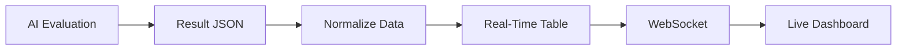
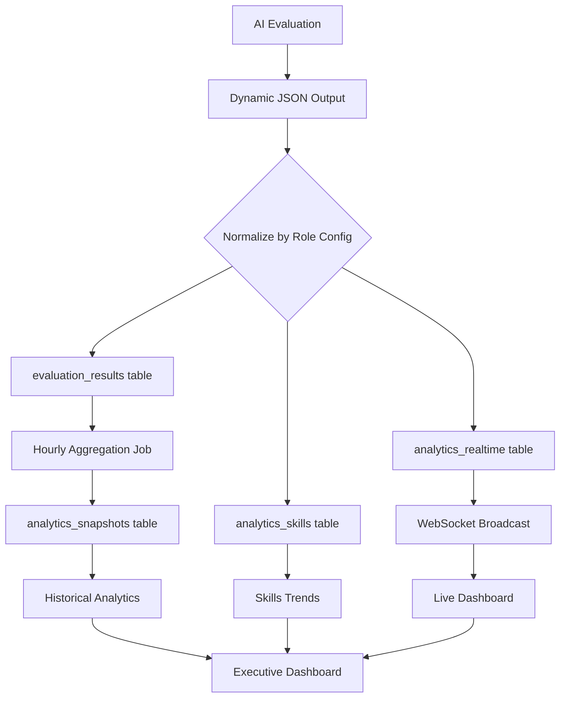

# 🔗 Supabase to Analytics Data Connection Plan

## 🎯 Core Challenge
Every role has different configurations (skills, questions, bonuses, penalties) resulting in DYNAMIC output structures. We need a flexible system that aggregates diverse data into unified analytics.

---

## 📊 Database Schema for Analytics

### 1. **Analytics Aggregation Tables**

```sql
-- Centralized analytics data warehouse
CREATE TABLE public.analytics_snapshots (
  id UUID PRIMARY KEY DEFAULT gen_random_uuid(),
  snapshot_type TEXT NOT NULL, -- 'hourly', 'daily', 'weekly', 'monthly'
  created_at TIMESTAMPTZ DEFAULT NOW(),
  
  -- Summary Metrics
  total_candidates INTEGER,
  total_evaluated INTEGER,
  total_qualified INTEGER,
  total_rejected INTEGER,
  
  -- Performance Metrics
  avg_processing_time_seconds DECIMAL,
  avg_score DECIMAL,
  avg_ai_confidence DECIMAL,
  
  -- By Status
  status_distribution JSONB, -- {"qualified": 45, "rejected": 23, ...}
  
  -- By Role
  role_performance JSONB, -- {"role_id_1": {...metrics}, "role_id_2": {...}}
  
  -- By Time
  hourly_distribution JSONB, -- Processing patterns
  
  user_id UUID REFERENCES public.users(id)
);

-- Real-time metrics table
CREATE TABLE public.analytics_realtime (
  id UUID PRIMARY KEY DEFAULT gen_random_uuid(),
  metric_name TEXT NOT NULL,
  metric_value JSONB NOT NULL,
  metric_timestamp TIMESTAMPTZ DEFAULT NOW(),
  session_id UUID,
  role_id UUID,
  user_id UUID,
  
  INDEX idx_analytics_realtime_timestamp (metric_timestamp DESC),
  INDEX idx_analytics_realtime_session (session_id),
  INDEX idx_analytics_realtime_role (role_id)
);

-- Normalized skills analytics
CREATE TABLE public.analytics_skills (
  id UUID PRIMARY KEY DEFAULT gen_random_uuid(),
  skill_name TEXT NOT NULL,
  role_id UUID REFERENCES public.roles(id),
  
  -- Aggregate counts
  candidates_with_skill INTEGER DEFAULT 0,
  candidates_without_skill INTEGER DEFAULT 0,
  avg_proficiency_level DECIMAL,
  
  -- Trends
  trend_direction TEXT, -- 'up', 'down', 'stable'
  trend_percentage DECIMAL,
  
  -- Time-based
  last_updated TIMESTAMPTZ DEFAULT NOW(),
  
  UNIQUE(skill_name, role_id)
);

-- Requirements effectiveness tracking
CREATE TABLE public.analytics_requirements (
  id UUID PRIMARY KEY DEFAULT gen_random_uuid(),
  requirement_type TEXT, -- 'education', 'experience', 'skill', 'bonus', 'penalty'
  requirement_value TEXT, -- The actual requirement
  role_id UUID REFERENCES public.roles(id),
  
  -- Impact metrics
  candidates_eliminated INTEGER DEFAULT 0,
  quality_impact_score DECIMAL, -- How much it improves quality
  false_negative_rate DECIMAL, -- Good candidates wrongly eliminated
  
  -- Recommendations
  ai_recommendation TEXT, -- 'keep', 'remove', 'modify'
  suggested_modification TEXT,
  
  last_calculated TIMESTAMPTZ DEFAULT NOW()
);
```

---

## 🔄 Data Collection Strategy

### 1. **Real-Time Data Collection Points**

```typescript
// After each AI evaluation completes
async function collectEvaluationMetrics(evaluationResult: any, roleConfig: any) {
  
  // 1. Store raw result
  await supabase.from('evaluation_results').insert({
    ...evaluationResult,
    raw_output: evaluationResult // Keep full JSON for later analysis
  });

  // 2. Extract and normalize key metrics
  const metrics = {
    // Core metrics (always present)
    candidate_id: evaluationResult.candidate_id,
    score: evaluationResult.expanded_view.summary.score,
    status: evaluationResult.table_view.status,
    confidence: evaluationResult.expanded_view.summary.confidence,
    
    // Dynamic metrics (may not exist)
    education_met: evaluationResult.table_view.education_met ?? null,
    experience_met: evaluationResult.table_view.experience_met ?? null,
    mandatory_skills_met: evaluationResult.table_view.mandatory_skills_met ?? null,
    
    // Handle dynamic skills array
    skills_data: normalizeSkills(evaluationResult, roleConfig),
    
    // Handle dynamic questions
    questions_data: normalizeQuestions(evaluationResult, roleConfig),
    
    // Handle dynamic modifiers
    modifiers_data: normalizeModifiers(evaluationResult, roleConfig)
  };

  // 3. Update real-time analytics
  await updateRealtimeAnalytics(metrics);
  
  // 4. Update aggregated analytics
  await updateAggregatedAnalytics(metrics, roleConfig);
}
```

### 2. **Normalization Functions**

```typescript
// Normalize dynamic skills into consistent structure
function normalizeSkills(result: any, roleConfig: any): NormalizedSkills {
  const skills = {};
  
  // Get all skills from role config
  roleConfig.skills.forEach(skill => {
    const foundSkill = result.expanded_view.skills_assessment?.find(
      s => s.name === skill.skill_name
    );
    
    skills[skill.skill_name] = {
      required: skill.is_required,
      found: foundSkill?.found ?? false,
      level: foundSkill?.level ?? 'NONE',
      weight: skill.weight
    };
  });
  
  return skills;
}

// Normalize dynamic questions
function normalizeQuestions(result: any, roleConfig: any): NormalizedQuestions {
  const questions = {};
  
  roleConfig.questions?.forEach(q => {
    const answer = result.expanded_view.questions_assessment?.find(
      qa => qa.question === q.question_text
    );
    
    questions[q.id] = {
      question: q.question_text,
      answered: answer?.answer ?? 'NO',
      quality: answer?.quality ?? 'NONE',
      weight: q.weight
    };
  });
  
  return questions;
}

// Normalize modifiers (bonuses/penalties)
function normalizeModifiers(result: any, roleConfig: any): NormalizedModifiers {
  return {
    bonuses_configured: roleConfig.bonus_config?.enabled ?? false,
    bonuses_matched: result.expanded_view.modifiers?.bonuses_found ?? [],
    bonus_points: result.expanded_view.modifiers?.bonus_points ?? 0,
    
    penalties_configured: roleConfig.penalty_config?.enabled ?? false,
    penalties_triggered: result.expanded_view.modifiers?.penalties_found ?? [],
    penalty_points: result.expanded_view.modifiers?.penalty_points ?? 0,
    
    net_modifier: result.expanded_view.modifiers?.net_modifier ?? 0
  };
}
```

---

## 📈 Analytics Data Pipelines

### 1. **Real-Time Pipeline**



```typescript
// Supabase Edge Function for real-time processing
export async function processRealtimeAnalytics(result: any) {
  // Insert into real-time table
  const { data, error } = await supabase
    .from('analytics_realtime')
    .insert({
      metric_name: 'candidate_evaluated',
      metric_value: {
        score: result.score,
        status: result.status,
        role_id: result.role_id,
        timestamp: new Date().toISOString()
      },
      session_id: result.session_id,
      role_id: result.role_id,
      user_id: result.user_id
    });

  // Broadcast via WebSocket
  await supabase.channel('analytics-live').send({
    type: 'broadcast',
    event: 'new_evaluation',
    payload: { score: result.score, status: result.status }
  });
}
```

### 2. **Batch Aggregation Pipeline**

```typescript
// Runs every hour via cron job
export async function aggregateHourlyAnalytics() {
  const oneHourAgo = new Date(Date.now() - 60 * 60 * 1000);
  
  // Get all evaluations from last hour
  const { data: evaluations } = await supabase
    .from('evaluation_results')
    .select(`
      *,
      roles (
        title,
        skills:role_skills(*),
        questions:role_questions(*)
      )
    `)
    .gte('created_at', oneHourAgo.toISOString());

  // Aggregate by role (handling different structures)
  const roleAggregates = {};
  
  evaluations.forEach(eval => {
    const roleId = eval.role_id;
    
    if (!roleAggregates[roleId]) {
      roleAggregates[roleId] = {
        total_evaluated: 0,
        total_qualified: 0,
        scores: [],
        skills_performance: {},
        questions_performance: {},
        modifiers_impact: { bonuses: 0, penalties: 0 }
      };
    }
    
    // Update counts
    roleAggregates[roleId].total_evaluated++;
    if (eval.status === 'QUALIFIED') {
      roleAggregates[roleId].total_qualified++;
    }
    roleAggregates[roleId].scores.push(eval.overall_score);
    
    // Aggregate skills (dynamic per role)
    eval.roles.skills.forEach(skill => {
      if (!roleAggregates[roleId].skills_performance[skill.skill_name]) {
        roleAggregates[roleId].skills_performance[skill.skill_name] = {
          found_count: 0,
          total_checked: 0
        };
      }
      
      const skillResult = eval.skills_analysis?.find(s => s.skill_name === skill.skill_name);
      roleAggregates[roleId].skills_performance[skill.skill_name].total_checked++;
      if (skillResult?.found) {
        roleAggregates[roleId].skills_performance[skill.skill_name].found_count++;
      }
    });
    
    // Aggregate modifiers impact
    if (eval.bonus_points) {
      roleAggregates[roleId].modifiers_impact.bonuses += eval.bonus_points;
    }
    if (eval.penalty_points) {
      roleAggregates[roleId].modifiers_impact.penalties += eval.penalty_points;
    }
  });

  // Store aggregated snapshot
  await supabase.from('analytics_snapshots').insert({
    snapshot_type: 'hourly',
    total_candidates: evaluations.length,
    total_qualified: evaluations.filter(e => e.status === 'QUALIFIED').length,
    role_performance: roleAggregates,
    avg_score: calculateAverage(evaluations.map(e => e.overall_score)),
    status_distribution: getStatusDistribution(evaluations)
  });
}
```

---

## 🔍 Query Patterns for Analytics

### 1. **Flexible Queries for Dynamic Data**

```sql
-- Get skills performance across all roles (handles different skill sets)
WITH skill_aggregates AS (
  SELECT 
    skill_name,
    COUNT(*) FILTER (WHERE found = true) as found_count,
    COUNT(*) as total_count,
    AVG(CASE WHEN found THEN score ELSE 0 END) as avg_score_when_found
  FROM evaluation_results,
       jsonb_array_elements(skills_analysis) as skill
  WHERE created_at >= NOW() - INTERVAL '7 days'
  GROUP BY skill_name
)
SELECT 
  skill_name,
  found_count,
  total_count,
  ROUND(found_count::DECIMAL / total_count * 100, 2) as availability_percentage,
  avg_score_when_found
FROM skill_aggregates
ORDER BY total_count DESC;

-- Get modifier effectiveness by role
SELECT 
  r.title as role_title,
  AVG(er.bonus_points) as avg_bonus_impact,
  AVG(er.penalty_points) as avg_penalty_impact,
  COUNT(*) FILTER (WHERE er.bonus_points > 0) as candidates_with_bonus,
  COUNT(*) FILTER (WHERE er.penalty_points < 0) as candidates_with_penalty
FROM evaluation_results er
JOIN roles r ON er.role_id = r.id
WHERE er.created_at >= NOW() - INTERVAL '30 days'
GROUP BY r.id, r.title
ORDER BY r.title;

-- Dynamic requirements analysis
SELECT 
  role_id,
  requirement_type,
  requirement_value,
  candidates_eliminated,
  quality_impact_score,
  ai_recommendation
FROM analytics_requirements
WHERE quality_impact_score < 5  -- Requirements that aren't helping much
  AND candidates_eliminated > 100  -- But eliminating many candidates
ORDER BY candidates_eliminated DESC;
```

### 2. **Supabase Realtime Subscriptions**

```typescript
// Subscribe to real-time updates for live dashboard
const analyticsChannel = supabase
  .channel('analytics-updates')
  .on('postgres_changes', {
    event: 'INSERT',
    schema: 'public',
    table: 'analytics_realtime',
    filter: `user_id=eq.${userId}`
  }, (payload) => {
    // Update dashboard in real-time
    updateDashboardMetric(payload.new);
  })
  .on('postgres_changes', {
    event: 'INSERT',
    schema: 'public',
    table: 'evaluation_results',
    filter: `user_id=eq.${userId}`
  }, (payload) => {
    // New evaluation completed
    addToLiveTable(payload.new);
    updateCounters(payload.new);
  })
  .subscribe();
```

---

## 🎨 Frontend Data Fetching

### 1. **Dashboard Data Hooks**

```typescript
// Hook for fetching role-specific analytics
export function useRoleAnalytics(roleId: string) {
  const [data, setData] = useState(null);
  
  useEffect(() => {
    // Fetch aggregated data
    const fetchAnalytics = async () => {
      // Get role configuration first (to know what metrics exist)
      const { data: role } = await supabase
        .from('roles')
        .select(`
          *,
          skills:role_skills(*),
          questions:role_questions(*)
        `)
        .eq('id', roleId)
        .single();
      
      // Get evaluation results for this role
      const { data: results } = await supabase
        .from('evaluation_results')
        .select('*')
        .eq('role_id', roleId)
        .order('created_at', { ascending: false })
        .limit(100);
      
      // Process and normalize data based on role structure
      const analytics = processRoleSpecificAnalytics(results, role);
      setData(analytics);
    };
    
    fetchAnalytics();
    
    // Subscribe to updates
    const subscription = supabase
      .channel(`role-${roleId}`)
      .on('postgres_changes', {
        event: '*',
        schema: 'public',
        table: 'evaluation_results',
        filter: `role_id=eq.${roleId}`
      }, () => {
        fetchAnalytics(); // Refetch on changes
      })
      .subscribe();
    
    return () => subscription.unsubscribe();
  }, [roleId]);
  
  return data;
}

// Hook for cross-role comparison
export function useComparativeAnalytics(roleIds: string[]) {
  const [data, setData] = useState(null);
  
  useEffect(() => {
    const fetchComparative = async () => {
      // Fetch all roles with their different structures
      const { data: roles } = await supabase
        .from('roles')
        .select('*')
        .in('id', roleIds);
      
      // Fetch aggregated metrics for comparison
      const { data: snapshots } = await supabase
        .from('analytics_snapshots')
        .select('role_performance')
        .order('created_at', { ascending: false })
        .limit(1)
        .single();
      
      // Extract comparable metrics across different role structures
      const comparison = extractComparableMetrics(
        snapshots.role_performance,
        roles
      );
      
      setData(comparison);
    };
    
    fetchComparative();
  }, [roleIds]);
  
  return data;
}
```

### 2. **Data Processing Functions**

```typescript
// Process analytics for roles with different structures
function processRoleSpecificAnalytics(results: any[], role: any) {
  const analytics = {
    role_title: role.title,
    total_evaluated: results.length,
    
    // Core metrics (always present)
    avg_score: calculateAverage(results.map(r => r.overall_score)),
    qualification_rate: results.filter(r => r.status === 'QUALIFIED').length / results.length,
    
    // Dynamic skills analysis
    skills_analysis: {},
    
    // Dynamic questions analysis
    questions_analysis: {},
    
    // Dynamic modifiers analysis
    modifiers_analysis: {
      enabled: role.bonus_config?.enabled || role.penalty_config?.enabled,
      impact: null
    }
  };
  
  // Process skills (each role has different skills)
  if (role.skills && role.skills.length > 0) {
    role.skills.forEach(skill => {
      const skillResults = results.map(r => 
        r.skills_analysis?.find(s => s.skill_name === skill.skill_name)
      ).filter(Boolean);
      
      analytics.skills_analysis[skill.skill_name] = {
        availability: skillResults.filter(s => s.found).length / skillResults.length,
        avg_proficiency: calculateAverageProficiency(skillResults),
        is_bottleneck: skillResults.filter(s => s.found).length < results.length * 0.3
      };
    });
  }
  
  // Process questions (dynamic per role)
  if (role.questions && role.questions.length > 0) {
    role.questions.forEach(question => {
      const questionResults = results.map(r =>
        r.questions_analysis?.find(q => q.question === question.question_text)
      ).filter(Boolean);
      
      analytics.questions_analysis[question.question_text] = {
        positive_rate: questionResults.filter(q => q.answer === 'YES').length / questionResults.length,
        avg_quality: calculateAverageQuality(questionResults)
      };
    });
  }
  
  // Process modifiers if configured
  if (analytics.modifiers_analysis.enabled) {
    const bonusImpact = results.map(r => r.bonus_points || 0);
    const penaltyImpact = results.map(r => r.penalty_points || 0);
    
    analytics.modifiers_analysis.impact = {
      avg_bonus: calculateAverage(bonusImpact),
      avg_penalty: calculateAverage(penaltyImpact),
      net_impact: calculateAverage(bonusImpact) + calculateAverage(penaltyImpact),
      effectiveness: bonusImpact.filter(b => b > 0).length / results.length
    };
  }
  
  return analytics;
}

// Extract comparable metrics across roles with different structures
function extractComparableMetrics(rolePerformance: any, roles: any[]) {
  const comparableMetrics = {
    roles: [],
    common_metrics: {
      avg_score: {},
      qualification_rate: {},
      time_to_fill: {},
      candidate_volume: {}
    },
    unique_metrics_by_role: {}
  };
  
  roles.forEach(role => {
    const perf = rolePerformance[role.id];
    if (!perf) return;
    
    // Extract common metrics (present in all roles)
    comparableMetrics.common_metrics.avg_score[role.title] = 
      calculateAverage(perf.scores);
    comparableMetrics.common_metrics.qualification_rate[role.title] = 
      perf.total_qualified / perf.total_evaluated;
    comparableMetrics.common_metrics.candidate_volume[role.title] = 
      perf.total_evaluated;
    
    // Store role-specific metrics separately
    comparableMetrics.unique_metrics_by_role[role.id] = {
      skills_count: role.skills?.length || 0,
      questions_count: role.questions?.length || 0,
      has_modifiers: !!(role.bonus_config?.enabled || role.penalty_config?.enabled),
      specific_metrics: perf.skills_performance
    };
  });
  
  return comparableMetrics;
}
```

---

## 🔧 Handling Dynamic Data Challenges

### 1. **Challenge: Different Skills per Role**

**Solution: Flexible JSONB Storage**
```sql
-- Store skills as JSONB to handle any structure
skills_analysis JSONB

-- Query with JSON operators
SELECT 
  skills_analysis->>'skill_name' as skill,
  COUNT(*) as frequency
FROM evaluation_results
WHERE skills_analysis @> '[{"found": true}]'
GROUP BY skills_analysis->>'skill_name';
```

### 2. **Challenge: Variable Questions per Role**

**Solution: Normalized Question Bank**
```sql
-- Create a master question bank
CREATE TABLE public.analytics_question_bank (
  id UUID PRIMARY KEY,
  question_text TEXT UNIQUE,
  usage_count INTEGER DEFAULT 0,
  avg_positive_response_rate DECIMAL
);

-- Link evaluations to questions
CREATE TABLE public.analytics_question_responses (
  evaluation_id UUID,
  question_id UUID,
  response TEXT,
  quality TEXT
);
```

### 3. **Challenge: Dynamic Modifiers**

**Solution: Event-Based Tracking**
```sql
-- Track each modifier as an event
CREATE TABLE public.analytics_modifier_events (
  id UUID PRIMARY KEY,
  evaluation_id UUID,
  modifier_type TEXT, -- 'bonus' or 'penalty'
  modifier_name TEXT,
  points_impact DECIMAL,
  triggered BOOLEAN
);
```

---

## 🚀 Performance Optimization

### 1. **Materialized Views for Common Queries**

```sql
-- Materialized view for skills analytics
CREATE MATERIALIZED VIEW mv_skills_analytics AS
SELECT 
  skill_name,
  COUNT(*) as total_evaluations,
  COUNT(*) FILTER (WHERE (skills_analysis->>'found')::boolean = true) as found_count,
  AVG(overall_score) as avg_score_with_skill,
  user_id
FROM evaluation_results,
     jsonb_array_elements(skills_analysis) as skill(skill_name, data)
GROUP BY skill_name, user_id;

-- Refresh every hour
CREATE OR REPLACE FUNCTION refresh_analytics_views()
RETURNS void AS $$
BEGIN
  REFRESH MATERIALIZED VIEW CONCURRENTLY mv_skills_analytics;
  REFRESH MATERIALIZED VIEW CONCURRENTLY mv_role_performance;
END;
$$ LANGUAGE plpgsql;

-- Schedule refresh
SELECT cron.schedule('refresh-analytics', '0 * * * *', 'SELECT refresh_analytics_views()');
```

### 2. **Indexes for Fast Queries**

```sql
-- Indexes for dynamic JSON queries
CREATE INDEX idx_skills_analysis ON evaluation_results USING GIN (skills_analysis);
CREATE INDEX idx_questions_analysis ON evaluation_results USING GIN (questions_analysis);
CREATE INDEX idx_modifiers ON evaluation_results USING GIN ((expanded_view->'modifiers'));

-- Composite indexes for common filters
CREATE INDEX idx_role_date ON evaluation_results(role_id, created_at DESC);
CREATE INDEX idx_user_status ON evaluation_results(user_id, status);
```

---

## 📊 Complete Data Flow



---

## 🎯 Key Success Factors

1. **Flexible Schema**: JSONB columns handle any role structure
2. **Normalization Layer**: Consistent analytics despite dynamic inputs
3. **Real-time + Batch**: Live updates with efficient aggregation
4. **Role-Aware Processing**: Each role's unique structure is preserved
5. **Performance Optimization**: Materialized views for complex queries
6. **Scalability**: Designed for millions of evaluations

This plan ensures that no matter how different each role's configuration is, we can still provide comprehensive, real-time analytics across the entire system!